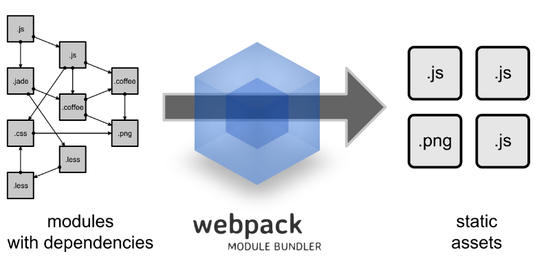

# 一、WebPack 简介

> Webpack 是一个前端资源加载/打包工具。它将根据模块的依赖关系进行静态分析，然后将这些模块按照指定的规则生成对应的静态资源。
>
> 从图中我们可以看出，Webpack 可以将多种静态资源 js、css、less 转换成一个静态文件，减少了页面的请求。



# 二、安装

```bash
# 安装基本环境，可处理js代码
npm install webpack -g
npm install -D webpack-cli
webpack --verison
# 安装加载器， 处理css 代码
npm install css-loader style-loader
```

# 三、配置文件

entry.js

```javascript
require("1.js");
require("1.js");
require("1.css");
require("1.css");
```

```javascript
// webpack.config.js 
module.exports = {
    entry: "./entry.js",
    output: {
        path: __dirname,
        filename: "bundle.js"
    },
    module: {
    	rules:[{
    		test:/\.css$/,
    		use:["style-loader","css-loader"]
    	}]
    }
};
```

```bash
webpack
```

# 四、其他

## 1. 使用插件

插件在 webpack 的配置信息 plugins 选项中指定，用于完成一些 loader 不能完成的工作。

webpack 自带一些插件，你可以通过 cnpm 安装一些插件。

使用内置插件需要通过以下命令来安装：

```
cnpm install webpack --save-dev
```

比如我们可以安装内置的 BannerPlugin 插件，用于在文件头部输出一些注释信息。

修改 webpack.config.js，代码如下：

## app/webpack.config.js 文件

```javascript
var webpack=require('webpack');  
module.exports = {    
    entry: "./runoob1.js",    
    output: {        
        path: __dirname,        
        filename: "bundle.js"    
    },    
    module: {        
        loaders: [            
            { test: /\.css$/, loader: "style-loader!css-loader" }        
        ]    
    },    
    plugins:[    
        new webpack.BannerPlugin('菜鸟教程 webpack 实例')    
    ] 
};
```

然后运行:

```
webpack
```

## 2. 开发技巧

当项目逐渐变大，webpack 的编译时间会变长，可以通过参数让编译的输出内容带有进度和颜色。

```
webpack --progress --colors
```

如果不想每次修改模块后都重新编译，那么可以启动监听模式。开启监听模式后，没有变化的模块会在编译后缓存到内存中，而不会每次都被重新编译，所以监听模式的整体速度是很快的。

```
webpack --progress --colors --watch
```

当然，我们可以使用 webpack-dev-server 开发服务，这样我们就能通过 localhost:8080 启动一个 express 静态资源 web 服务器，并且会以监听模式自动运行 webpack，在浏览器打开 http://localhost:8080/ 或 http://localhost:8080/webpack-dev-server/ 可以浏览项目中的页面和编译后的资源输出，并且通过一个 socket.io 服务实时监听它们的变化并自动刷新页面。

```bash
# 安装 
cnpm install webpack-dev-server -g  
# 运行 
webpack-dev-server --progress --colors
```

还可以在package.json 中可以编写nmp脚本